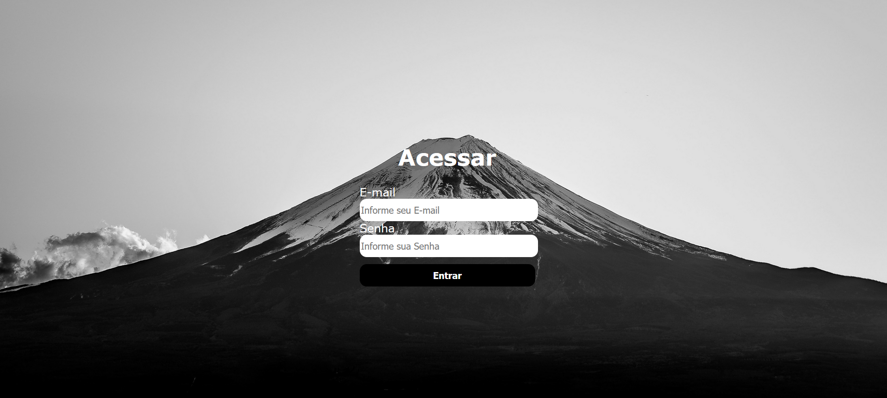

<h1 align="center">Projeto tela login</h1>

#### ⌨️ Descrição
Projeto de programação Front-End realizado durante a aula do professor  [Leonardo Rocha](https://github.com/leonardossrocha) no dia 04/03/2026.
Durante a aula, aprendemos e revisamos alguns conceitos básicos para a construção de um site simples utilizando HTML5 e CSS3. Como atividade prática, foi proposto o desenvolvimento de uma tela de login, com o objetivo de aplicar na prática a estrutura do HTML e a estilização utilizando CSS.
>Vale destacar que já realizamos um projeto semelhante anteriormente, porém este foi pensado como uma versão mais simples, focada principalmente na fixação dos conceitos fundamentais apresentados em aula.
A seguir, apresento o resultado final do projeto desenvolvido.

#### 🖥️ Objetivos do projeto
Desenvolver uma tela de Login usando:
> HTML5, CSS3
Aplicativos usados:
> VsCode (Programação/Hospedagem), Github (Mostrar projeto), Linkedin (Divulgação)

#### 🧑‍💻 Processo criativo
O processo criativo foi relativamente simples. No trabalho foi proposta a criação de uma tela básica utilizando cores em gradiente para compor o visual da interface. Durante a análise e desenvolvimento do código, percebi que havia a possibilidade de adicionar também uma imagem de fundo, o que poderia deixar a tela um pouco mais interessante visualmente. 
A partir dessa ideia, desenvolvi uma tela de login simples, mantendo a proposta inicial de simplicidade, mas adicionando esse pequeno detalhe estético para melhorar a aparência geral da página.
A seguir, apresento o resultado final do projeto desenvolvido.

---

---

  
  
  
  
  

 ---
 
Conexões 📶
------- | ------
Github | [Perfil](https://github.com/Jslus12)
Linkedin | [Perfil](https://www.linkedin.com/in/jo%C3%A3o-lucas-d-ba44923b0/)

> _Por enquanto isso é tudo_